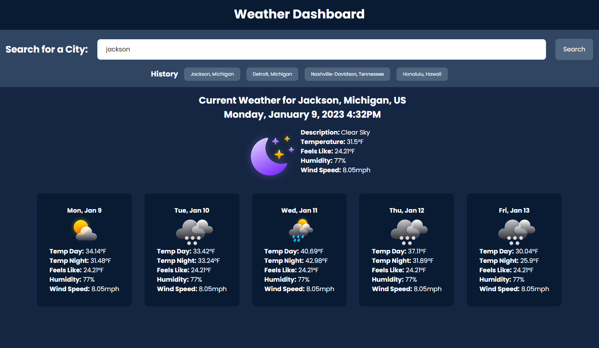

# Weather Dashboard

## Search Functionality

- Search for city using city name or zip code.
- If searched by city, you are presented with a dialogue box with multiple choices to verify which city you want. (Ex. Jackson, Michigan, Jackson, Mississippi, etc.)
- If input is formatted improperly, user is presented with an error message to try again.
- Once the user has searched for a city, it is displayed in the history section underneath the search box. Click the button if you wish you revisit a past search.

## Weather Functionality

- Displays current weather in selected city showing a variety of different weather variables (Ex. Temperature, Humidity, Wind Speed, etc.)
- Displays 5 day forecast
- Weather icons change depending on weather conditions

Link to Deployment ---> https://tonytrocino.github.io/weather-dashboard/

